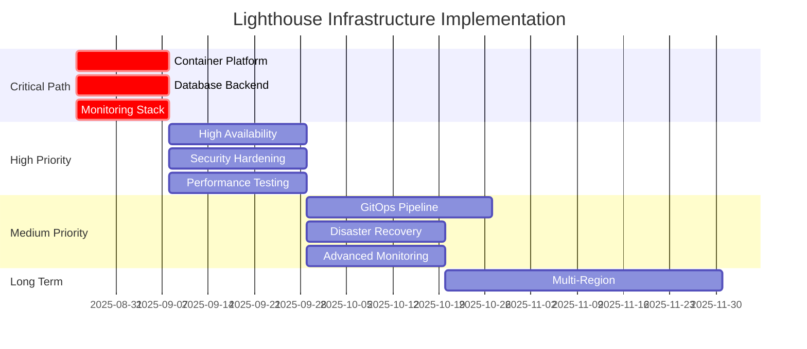

# Infrastructure Architect Next Actions

**Project**: Lighthouse System Infrastructure and Deployment Architecture  
**Updated**: 2025-08-24 16:54:35 UTC  
**Priority**: HIGH - Critical infrastructure gaps blocking production deployment

## Immediate Actions Required (Weeks 1-2)

### 1. Container Platform Implementation ⚡ CRITICAL
**Priority**: P0 - Blocking production deployment  
**Timeline**: 1-2 weeks  
**Owner**: Infrastructure Team

**Tasks**:
- [ ] Create multi-stage Dockerfiles for all bridge components
- [ ] Design Kubernetes namespace and resource allocation strategy
- [ ] Implement privileged container strategy for FUSE mounts or CSI driver
- [ ] Configure service discovery and internal networking
- [ ] Set up resource limits and quotas for all components

**Deliverables**:
- `lighthouse-bridge/Dockerfile` with optimized layers
- `kubernetes/manifests/` with complete deployment configs
- FUSE mounting strategy documentation
- Service mesh configuration (Istio recommended)

### 2. Production Database Backend ⚡ CRITICAL
**Priority**: P0 - Event store foundation  
**Timeline**: 1-2 weeks  
**Owner**: Database/Infrastructure Team

**Tasks**:
- [ ] Deploy PostgreSQL cluster with high availability (3 nodes minimum)
- [ ] Implement connection pooling with PgBouncer
- [ ] Configure automated backups with point-in-time recovery
- [ ] Migrate event store from SQLite to PostgreSQL
- [ ] Deploy Redis Sentinel cluster for distributed caching

**Deliverables**:
- PostgreSQL cluster with failover configuration
- Database migration scripts and validation procedures
- Redis Sentinel cluster for session management
- Backup and recovery automation

### 3. Monitoring and Observability Foundation ⚡ CRITICAL
**Priority**: P0 - Operational visibility  
**Timeline**: 1-2 weeks  
**Owner**: SRE/Operations Team

**Tasks**:
- [ ] Deploy Prometheus + Grafana + AlertManager stack
- [ ] Implement custom metrics collection for bridge components
- [ ] Configure alerting rules for system health and performance
- [ ] Set up log aggregation with structured logging
- [ ] Create operational dashboards for system monitoring

**Deliverables**:
- Complete monitoring stack deployment
- Bridge-specific Grafana dashboards
- AlertManager configuration with incident escalation
- Centralized logging infrastructure

## Short-term Actions (Weeks 3-4)

### 4. High Availability Architecture 🔄 HIGH
**Priority**: P1 - Production resilience  
**Timeline**: 2-3 weeks  
**Owner**: Infrastructure/Platform Team

**Tasks**:
- [ ] Implement HAProxy or NGINX load balancer for bridge endpoints
- [ ] Configure cross-zone deployment with pod anti-affinity
- [ ] Set up health checks and automated failover
- [ ] Implement circuit breakers and rate limiting
- [ ] Configure auto-scaling policies based on metrics

**Dependencies**: Monitoring stack must be deployed first

### 5. Security Hardening 🔐 HIGH
**Priority**: P1 - Production security  
**Timeline**: 2-3 weeks  
**Owner**: Security/Infrastructure Team

**Tasks**:
- [ ] Deploy HashiCorp Vault for secret management
- [ ] Implement mTLS between all services
- [ ] Configure network policies for micro-segmentation
- [ ] Set up certificate management and rotation
- [ ] Implement RBAC and service account management

**Dependencies**: Container platform must be deployed first

### 6. Performance Testing and Validation 📊 HIGH
**Priority**: P1 - SLA validation  
**Timeline**: 2-3 weeks  
**Owner**: Platform/QA Team

**Tasks**:
- [ ] Implement K6 or Locust performance testing suite
- [ ] Validate speed layer <100ms target under realistic load
- [ ] Test FUSE filesystem performance under concurrent access
- [ ] Benchmark expert agent coordination workflows
- [ ] Validate emergency degradation mode behavior

**Dependencies**: Container platform and monitoring stack

## Medium-term Actions (Weeks 5-8)

### 7. GitOps and CI/CD Pipeline 🚀 MEDIUM
**Priority**: P2 - Operational excellence  
**Timeline**: 3-4 weeks  
**Owner**: DevOps/Platform Team

**Tasks**:
- [ ] Deploy ArgoCD for GitOps-based deployments
- [ ] Implement Infrastructure as Code with Terraform
- [ ] Set up automated testing pipeline
- [ ] Configure blue-green deployment strategy
- [ ] Implement automated rollback procedures

### 8. Disaster Recovery and Business Continuity 🛡️ MEDIUM
**Priority**: P2 - Business resilience  
**Timeline**: 2-3 weeks  
**Owner**: SRE/Operations Team

**Tasks**:
- [ ] Design and test disaster recovery procedures
- [ ] Implement cross-region backup strategies
- [ ] Create operational runbooks for failure scenarios
- [ ] Set up automated recovery testing
- [ ] Document incident response procedures

### 9. Advanced Monitoring and Analytics 📈 MEDIUM
**Priority**: P2 - Operational insight  
**Timeline**: 2-3 weeks  
**Owner**: SRE/Platform Team

**Tasks**:
- [ ] Implement distributed tracing with OpenTelemetry
- [ ] Set up business metrics and KPI tracking
- [ ] Deploy log analysis and correlation tools
- [ ] Implement capacity planning and forecasting
- [ ] Create automated performance optimization

## Long-term Actions (Weeks 9-12)

### 10. Multi-Region Deployment 🌍 LOW
**Priority**: P3 - Global scaling  
**Timeline**: 4-6 weeks  
**Owner**: Infrastructure/Platform Team

**Tasks**:
- [ ] Design multi-region architecture
- [ ] Implement cross-region data replication
- [ ] Set up global load balancing
- [ ] Configure region failover strategies
- [ ] Implement cost optimization strategies

## Resource Allocation Requirements

### Infrastructure Team (4-6 engineers)
- **Kubernetes Specialist**: Container platform and orchestration
- **Database Engineer**: PostgreSQL cluster and data architecture
- **SRE/Operations**: Monitoring, alerting, and operational procedures
- **Security Engineer**: Authentication, authorization, and network security
- **DevOps Engineer**: CI/CD pipeline and automation
- **Platform Engineer**: Integration and system architecture

### Timeline and Dependencies

## Success Criteria

### Week 2 Milestones
- [ ] All bridge components running in Kubernetes
- [ ] PostgreSQL cluster operational with automated backups
- [ ] Basic monitoring and alerting functional

### Week 4 Milestones  
- [ ] High availability configuration tested and validated
- [ ] Security controls implemented and verified
- [ ] Performance targets validated under load

### Week 8 Milestones
- [ ] GitOps deployment pipeline fully operational
- [ ] Disaster recovery procedures tested and documented
- [ ] Advanced monitoring and analytics deployed

## Risk Mitigation

### Critical Risks
1. **FUSE Mount Containerization**: Complex privileged container requirements
   - **Mitigation**: CSI driver approach or proven privileged container patterns
   
2. **Database Migration Complexity**: SQLite to PostgreSQL migration risks
   - **Mitigation**: Thorough testing with rollback procedures
   
3. **Performance Degradation**: Infrastructure overhead impacting SLAs
   - **Mitigation**: Performance testing at each deployment stage

### Contingency Plans
- **Rollback Strategy**: Full infrastructure rollback procedures documented
- **Emergency Operations**: Manual override capabilities for all automation  
- **Alternative Approaches**: Backup solutions identified for each critical component

## Decision Points Requiring Review

1. **Service Mesh Selection**: Istio vs Linkerd vs Consul Connect
2. **CI/CD Platform**: ArgoCD vs Flux vs Jenkins X
3. **Secret Management**: Vault vs External Secrets Operator
4. **Database Clustering**: PostgreSQL HA vs CockroachDB for scale
5. **Container Runtime**: Docker vs containerd vs CRI-O

**Next Review**: Week 2 - Infrastructure deployment progress assessment