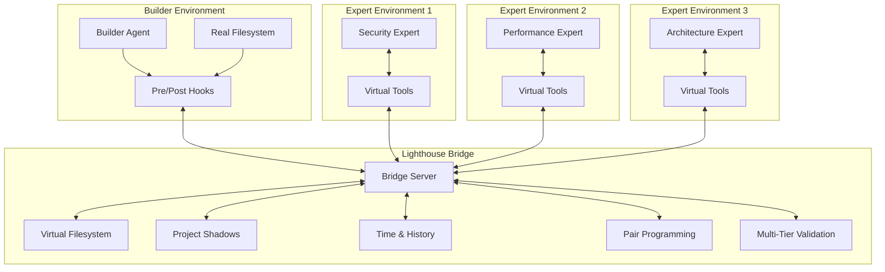
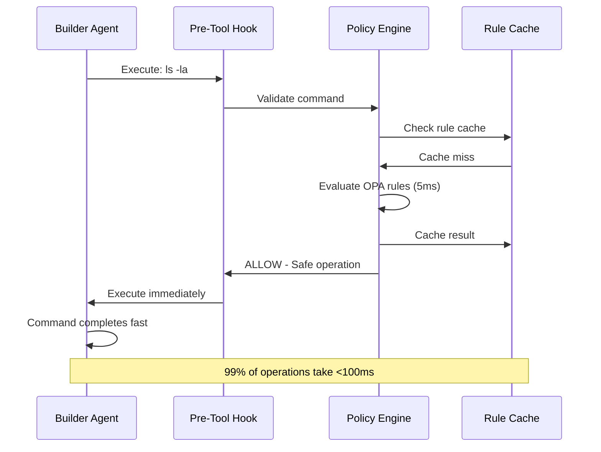
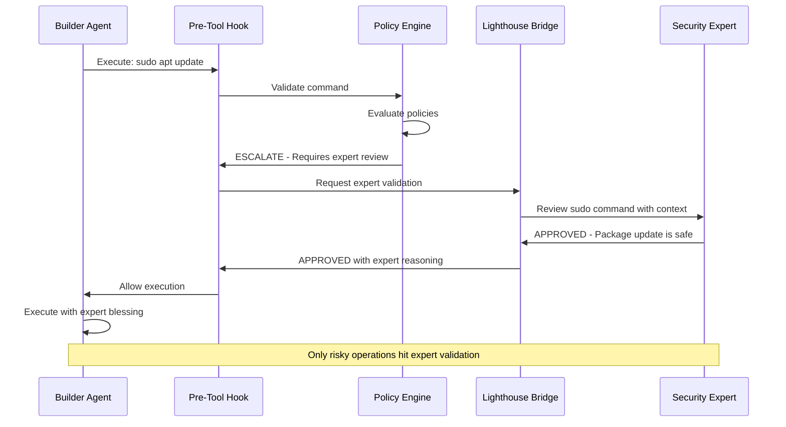
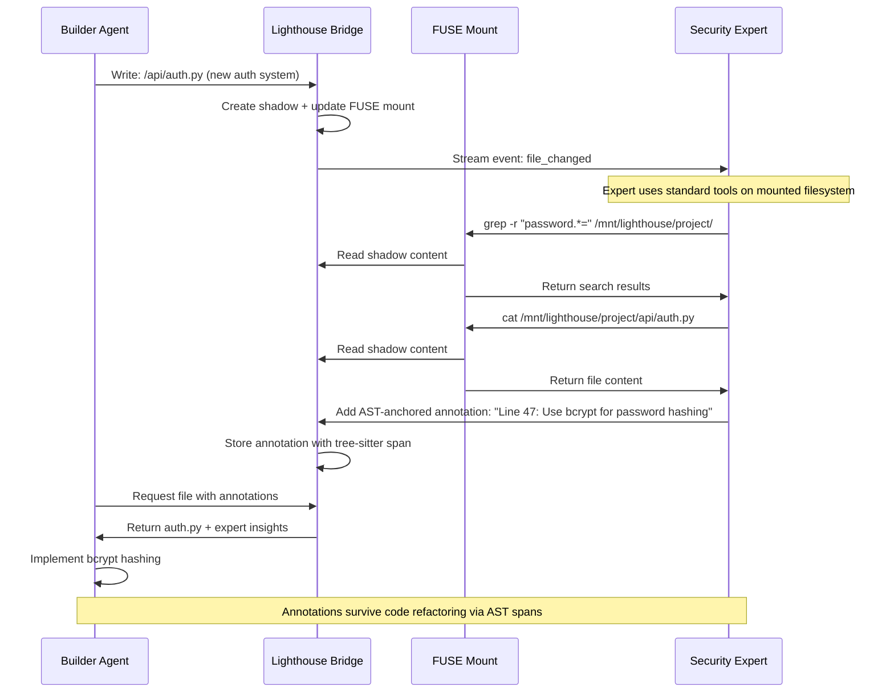
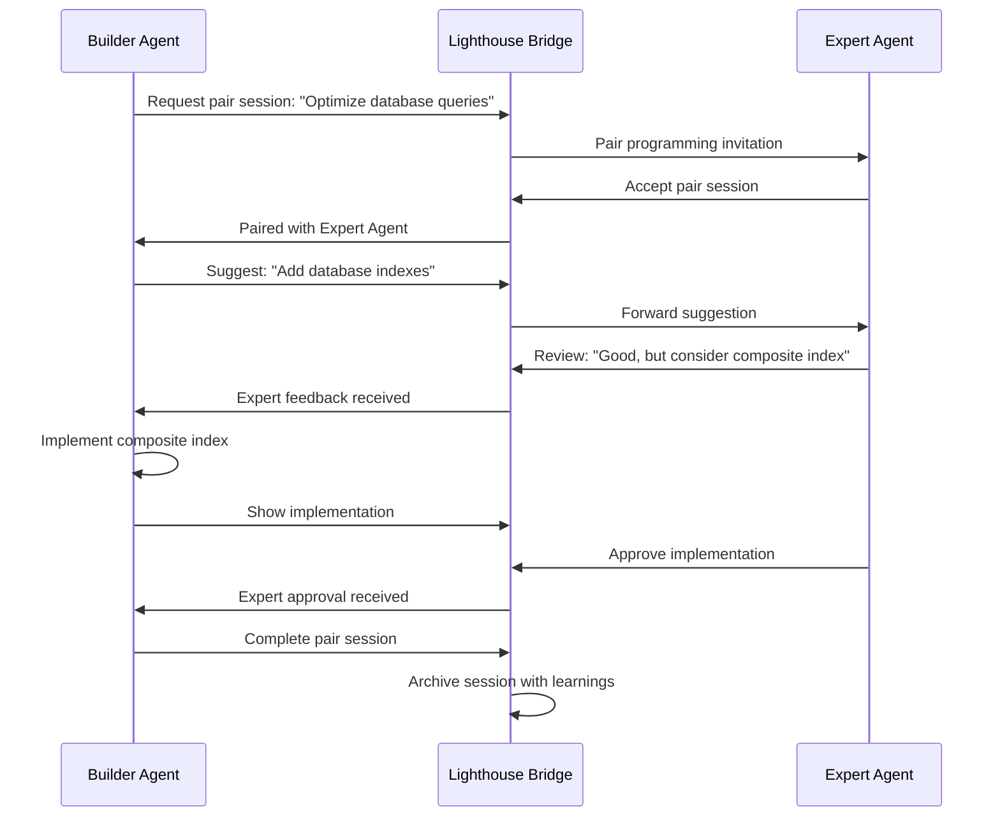
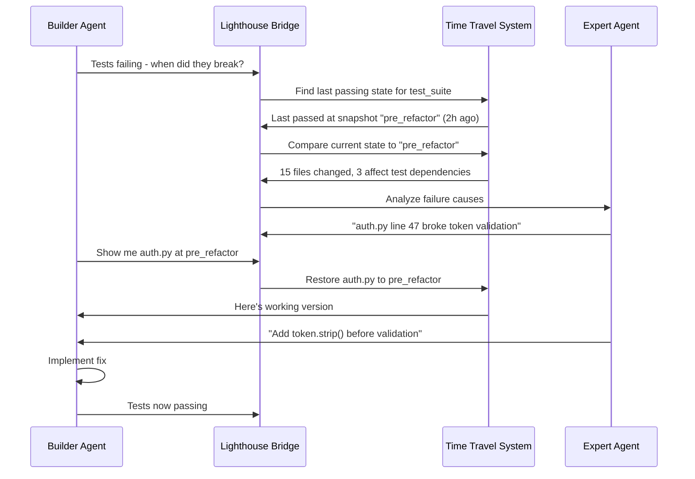

# Lighthouse: High-Level Design

## Executive Summary

Lighthouse is a revolutionary multi-agent coordination system that transforms dangerous or complex development tasks into safe, collaborative experiences. By creating a persistent bridge that maintains living shadows of project files, Lighthouse enables expert AI agents to provide real-time analysis and recommendations without filesystem access, while builder agents handle actual implementation under continuous validation.

**Key Enhancements Based on Specialist Reviews:**
- **High Availability**: Bridge clustering with automatic failover and distributed consensus
- **Enterprise Security**: Multi-expert consensus validation, FUSE mount hardening, and comprehensive audit trails
- **Production Operations**: Kubernetes deployment strategies, monitoring integration, and operational excellence
- **RL Training Integration**: Neural policy engines, training manager coordination, and experiment tracking
- **Scalable Architecture**: Event-sourced design supporting enterprise deployment with practical complexity management

## System Overview



## Core Components

### 1. **Builder Agent Environment**
- **Role**: Executes actual file operations and dangerous commands
- **Constraints**: Limited to implementation tasks, cannot make architectural decisions
- **Safety**: Protected by pre-tool validation hooks that consult the bridge
- **Integration**: All file operations automatically shadowed to bridge

### 2. **Lighthouse Bridge** (The Coordination Hub)
- **Persistent Daemon**: Runs 24/7, agents check in/out dynamically
- **Project Mirror**: Maintains perfect shadows of all project files
- **Multi-Tier Validation**: Sonnet → Opus → Deep Analysis pipeline
- **Pair Programming**: Real-time collaboration between agents
- **Time Travel**: Complete project history and snapshot management
- **Expert Coordination**: Routes insights between specialized agents

### 3. **Expert Agent Environments**
- **Security Expert**: Vulnerability scanning, compliance checking, threat analysis
- **Performance Expert**: Bottleneck detection, optimization recommendations
- **Architecture Expert**: Design patterns, dependency analysis, refactoring guidance
- **Code Review Expert**: Quality assurance, best practices enforcement
- **Zero Filesystem Access**: Work exclusively on bridge-maintained shadows

## Production Architecture Enhancements

Based on comprehensive specialist reviews, Lighthouse has been enhanced with enterprise-grade capabilities while maintaining its innovative simplicity:

### High Availability & Scalability
- **Bridge Clustering**: 3-node Raft consensus with automatic leader election and failover
- **Load Balancing**: HAProxy with health checks and circuit breakers
- **Distributed State**: PostgreSQL clustering with Redis Sentinel for caching
- **Horizontal Scaling**: Kubernetes deployment with pod anti-affinity and auto-scaling

### Security Hardening
- **Multi-Expert Consensus**: Minimum 2 experts from different specializations for high-risk operations
- **FUSE Mount Security**: Hardened with noexec, nosuid, read-only mounts and security contexts
- **Network Segmentation**: Comprehensive network policies and firewall rules
- **Audit Compliance**: SOC2, ISO 27001, and GDPR-compliant logging and monitoring

### Operational Excellence
- **Monitoring Integration**: Prometheus metrics, Grafana dashboards, and alerting rules
- **Container Security**: Non-root users, dropped capabilities, and AppArmor profiles
- **Backup Strategies**: Automated encrypted backups with geo-replication
- **Incident Response**: Comprehensive runbooks and automated remediation procedures

### Training System Integration
- **Manager Coordination**: SessionManager, ModelManager, and EnvManager integration patterns
- **State Synchronization**: Coordinated checkpointing and recovery across training components
- **Metrics Pipeline**: TensorBoard, Weights & Biases, and MLflow integration
- **Failure Recovery**: Graceful handling of training failures with automatic restart capabilities

## Architectural Principles

### 1. **Explicit Consistency Model**
- **Shadows are authoritative** per git tree-ish (commit or working tree snapshot)
- **Multi-file updates are atomic** at the snapshot level
- **Read-your-writes consistency** for the agent that made changes
- **Eventual consistency** for cross-agent visibility with explicit sync points

### 2. **Speed Layer First**
- **Policy-as-code** (OPA/Cedar rules) provides instant allow/deny decisions
- **LLM validation** only for operations flagged as risky by policy engine
- **Sub-100ms response** for common operations, expertise for dangerous ones

### 3. **Virtual Filesystem Transparency**
- **FUSE mount** exposes shadows as standard filesystem at `/mnt/lighthouse/project/`
- **Expert agents use standard tools** (grep, cat, find) on mounted shadows
- **Zero custom APIs** needed for file operations - full POSIX compatibility

### 4. **Event-Sourced Architecture**
- **All state changes are events** in an immutable log
- **Time travel** via event replay to any point in history
- **Bridge state** reconstructed from events, enabling perfect audit trails

### 5. **AST-Anchored Intelligence**
- **Annotations survive refactoring** using tree-sitter AST spans
- **Code intelligence** that adapts as code evolves
- **Persistent expertise** across development lifecycle

### 6. **Fail-Safe by Design**
- **Conservative defaults** - block when uncertain
- **Graceful degradation** when experts unavailable
- **Manual override path** for emergency situations

## System Architecture

### Bridge Core Components

```python
class LighthouseBridge:
    """Event-sourced coordination hub for multi-agent development."""
    
    def __init__(self):
        # Event-Sourced Core
        self.event_store = EventStore()  # Immutable event log
        self.snapshot_store = SnapshotStore()  # Periodic state snapshots
        self.current_state = self.rebuild_from_events()
        
        # Speed Layer (Policy Engine)
        self.policy_engine = PolicyEngine()  # OPA/Cedar rules
        self.rule_cache = RuleCache()  # Hot path optimization
        
        # Shadow Filesystem with FUSE
        self.shadow_filesystem = EventSourcedShadows()
        self.fuse_mount = VirtualFilesystemMount("/mnt/lighthouse")
        
        # Multi-Tier Validation (Policy → LLM)
        self.fast_validator = PolicyValidator()  # Tier-0: Instant
        self.expert_validator = LLMValidator()   # Tier-1: Risky operations
        
        # Agent Coordination
        self.agent_streams = StreamingCoordinator()  # SSE/WebSocket
        self.pair_programming = PairProgrammingCoordinator()
        
    async def validate_command(self, command: Command) -> ValidationResult:
        """Speed layer: Policy first, LLM only when needed."""
        # Tier-0: Instant policy evaluation
        policy_result = await self.policy_engine.evaluate(command)
        
        if policy_result.decision in ["allow", "block"]:
            return ValidationResult(
                status=policy_result.decision,
                reason=policy_result.reason,
                latency_ms=policy_result.duration,
                tier="policy"
            )
        
        # Tier-1: LLM validation for risky operations
        llm_result = await self.expert_validator.validate(
            command, 
            context=await self.build_context(command)
        )
        
        return ValidationResult(
            status=llm_result.status,
            reason=f"Policy flagged as risky: {policy_result.reason}. {llm_result.reason}",
            latency_ms=policy_result.duration + llm_result.duration,
            tier="expert"
        )
```

### Shadow Filesystem Architecture

```python
class EventSourcedShadows:
    """Event-sourced shadow filesystem with FUSE mount for transparency."""
    
    def __init__(self, event_store: EventStore):
        self.event_store = event_store
        self.current_shadows: Dict[str, ShadowFile] = {}
        
        # FUSE Mount for Expert Access
        self.fuse_mount = VirtualFilesystemMount("/mnt/lighthouse")
        self.ast_analyzer = ASTAnalyzer()  # Tree-sitter for AST spans
        
        # Rebuild state from events
        self.rebuild_shadows_from_events()
        
    async def update_shadow(self, file_path: str, content: str, operation: str, agent_id: str, base_snapshot: str = None):
        """Update shadow via event, with atomic consistency."""
        # Create shadow update event
        event = ShadowUpdateEvent(
            file_path=file_path,
            content_hash=hash_content(content),
            patch=compute_diff(self.current_shadows.get(file_path, ""), content) if base_snapshot else None,
            operation=operation,
            agent_id=agent_id,
            timestamp=time.time(),
            base_snapshot=base_snapshot
        )
        
        # Append to event log
        await self.event_store.append(event)
        
        # Apply event to current state
        await self.apply_shadow_event(event)
        
        # Update FUSE mount
        await self.fuse_mount.invalidate_path(file_path)
        
        # Notify expert agents via streams
        await self.notify_expert_streams('shadow_updated', {
            'file_path': file_path,
            'operation': operation,
            'agent_id': agent_id,
            'ast_spans': await self.ast_analyzer.extract_spans(file_path, content)
        })

class VirtualFilesystemMount:
    """FUSE mount exposing shadows as standard filesystem."""
    
    def __init__(self, mount_point: str):
        self.mount_point = mount_point  # /mnt/lighthouse
        self.bridge_client = BridgeClient()
        
    def getattr(self, path, fh=None):
        """File attributes from shadow metadata."""
        shadow = self.bridge_client.get_shadow(path)
        if not shadow:
            raise FuseOSError(errno.ENOENT)
            
        return dict(
            st_mode=(stat.S_IFREG | 0o644),
            st_size=len(shadow.content),
            st_mtime=shadow.last_modified,
            st_uid=os.getuid(),
            st_gid=os.getgid()
        )
    
    def read(self, path, length, offset, fh):
        """Read from shadow, guaranteed cache hit."""
        shadow = self.bridge_client.get_shadow(path)
        if not shadow:
            raise FuseOSError(errno.ENOENT)
            
        return shadow.content[offset:offset + length].encode()
    
    def readdir(self, path, fh):
        """List directory from shadow tree."""
        return ['.', '..'] + self.bridge_client.list_shadow_directory(path)

# Expert agents now just use standard tools:
# grep -r "SELECT" /mnt/lighthouse/project/  
# cat /mnt/lighthouse/project/api/routes.py
# find /mnt/lighthouse/project -name "*.py" -exec wc -l {} \;
```

### Speed Layer: Policy-First Validation

```python
class PolicyEngine:
    """Policy-as-code engine for instant validation decisions."""
    
    def __init__(self):
        self.opa_client = OPAClient()
        self.rule_cache = {}
        self.load_lighthouse_policies()
    
    def load_lighthouse_policies(self):
        """Load OPA/Cedar policy rules for instant decisions."""
        self.policies = {
            # Always safe operations
            "safe_operations": """
                package lighthouse.safe
                allow {
                    input.tool in ["Read", "Glob", "Grep", "LS"]
                }
            """,
            
            # Always blocked operations  
            "dangerous_operations": """
                package lighthouse.block
                block {
                    input.tool == "Bash"
                    contains(input.command, "rm -rf /")
                }
                block {
                    input.tool == "Bash"  
                    contains(input.command, "sudo rm")
                }
            """,
            
            # Requires expert review
            "risky_operations": """
                package lighthouse.review
                require_expert {
                    input.tool == "Bash"
                    contains(input.command, "sudo")
                }
                require_expert {
                    input.tool in ["Write", "Edit", "MultiEdit"]
                    startswith(input.file_path, "/etc/")
                }
            """
        }
    
    async def evaluate(self, command: Command) -> PolicyResult:
        """Instant policy evaluation - hot path optimization."""
        start_time = time.time()
        
        # Check cache first
        cache_key = f"{command.tool}:{hash(str(command.input))}"
        if cache_key in self.rule_cache:
            cached_result = self.rule_cache[cache_key]
            return PolicyResult(
                decision=cached_result["decision"],
                reason=cached_result["reason"], 
                duration=time.time() - start_time,
                cache_hit=True
            )
        
        # Evaluate policies in order
        policy_input = {
            "tool": command.tool,
            "input": command.input,
            "agent": command.agent
        }
        
        # 1. Check if always safe
        if await self.opa_client.query("lighthouse.safe.allow", policy_input):
            result = PolicyResult(
                decision="allow",
                reason=f"Safe operation: {command.tool}",
                duration=time.time() - start_time
            )
            self.rule_cache[cache_key] = result.to_dict()
            return result
        
        # 2. Check if always blocked
        if await self.opa_client.query("lighthouse.block.block", policy_input):
            return PolicyResult(
                decision="block",
                reason="Blocked by security policy",
                duration=time.time() - start_time
            )
        
        # 3. Check if requires expert review
        if await self.opa_client.query("lighthouse.review.require_expert", policy_input):
            return PolicyResult(
                decision="escalate",
                reason="Requires expert validation",
                duration=time.time() - start_time
            )
        
        # 4. Default to expert review for unknown operations
        return PolicyResult(
            decision="escalate", 
            reason=f"Unknown operation pattern: {command.tool}",
            duration=time.time() - start_time
        )

class ExpertValidator:
    """LLM-based validation for operations flagged by policy engine."""
    
    def __init__(self):
        self.model_client = ModelClient("claude-3-5-sonnet")
        
    async def validate(self, command: Command, context: ValidationContext) -> LLMResult:
        """Deep validation for policy-flagged risky operations."""
        # Only called for operations that policy engine marked as "escalate"
        prompt = self.build_validation_prompt(command, context)
        
        response = await self.model_client.complete(
            prompt=prompt,
            max_tokens=500,
            temperature=0.1  # Conservative for safety decisions
        )
        
        return self.parse_validation_response(response, command)
```

### Expert Agent Integration (Simplified with FUSE Mount)

```python
class ExpertAgent:
    """Base class for specialized expert agents - uses standard filesystem tools."""
    
    def __init__(self, specialty: str, bridge_url: str):
        self.specialty = specialty
        self.bridge_client = BridgeClient(bridge_url)
        self.agent_id = f"{specialty}_expert"
        self.project_mount = "/mnt/lighthouse/project"  # FUSE mount point
        
        # Standard tools work on mounted filesystem
        self.git_tools = GitTools(self.project_mount)
        self.ast_tools = ASTTools()
        
    async def continuous_monitoring(self):
        """Monitor via event stream + standard file tools."""
        # Subscribe to shadow update events
        async with self.bridge_client.stream_events() as event_stream:
            async for event in event_stream:
                if event.type == "shadow_updated":
                    await self.analyze_file_change(event.file_path)
                elif event.type == "snapshot_created":
                    await self.analyze_project_snapshot(event.snapshot_id)
    
    async def analyze_file_change(self, file_path: str):
        """Analyze file using standard tools on FUSE mount."""
        mount_path = f"{self.project_mount}/{file_path}"
        
        # Use standard file operations - no custom APIs needed!
        if os.path.exists(mount_path):
            # Read file content
            with open(mount_path, 'r') as f:
                content = f.read()
            
            # Get file stats
            stat_info = os.stat(mount_path)
            
            # Perform specialty analysis
            insights = await self.specialist_analysis(file_path, content)
            
            # Submit insights via bridge API
            for insight in insights:
                await self.bridge_client.add_annotation(
                    file_path=file_path,
                    line=insight.line,
                    message=insight.message,
                    category=self.specialty,
                    agent_id=self.agent_id,
                    ast_span=insight.ast_span  # Tree-sitter span for durability
                )

class SecurityExpert(ExpertAgent):
    """Security expert using standard tools on FUSE mount."""
    
    def __init__(self, bridge_url: str):
        super().__init__("security", bridge_url)
        self.semgrep_rules = self.load_security_rules()
    
    async def analyze_project_security(self):
        """Run security analysis using standard tools."""
        mount_path = self.project_mount
        
        # Use standard grep to find patterns
        sql_injection_files = subprocess.run([
            "grep", "-r", "-l", "execute.*+.*", mount_path, "--include=*.py"
        ], capture_output=True, text=True).stdout.strip().split('\n')
        
        for file_path in sql_injection_files:
            if file_path:  # Skip empty results
                relative_path = file_path.replace(f"{mount_path}/", "")
                
                # Get specific line numbers with more detailed grep
                lines = subprocess.run([
                    "grep", "-n", "execute.*+.*", file_path
                ], capture_output=True, text=True).stdout.strip().split('\n')
                
                for line in lines:
                    if ':' in line:
                        line_num, content = line.split(':', 1)
                        await self.bridge_client.add_annotation(
                            file_path=relative_path,
                            line=int(line_num),
                            message="🚨 Potential SQL injection - use parameterized queries",
                            category="security",
                            agent_id=self.agent_id,
                            severity="high"
                        )
        
        # Use standard find + xargs for secret detection
        secret_scan = subprocess.run([
            "find", mount_path, "-name", "*.py", "-exec", 
            "grep", "-Hn", "-E", "(password|api[_-]?key|secret|token)\\s*=\\s*['\"][^'\"]{8,}['\"]", 
            "{}", ";"
        ], capture_output=True, text=True)
        
        for match in secret_scan.stdout.strip().split('\n'):
            if ':' in match:
                file_path, line_num, content = match.split(':', 2)
                relative_path = file_path.replace(f"{mount_path}/", "")
                
                await self.bridge_client.add_annotation(
                    file_path=relative_path,
                    line=int(line_num),
                    message="🚨 Hardcoded credential detected - use environment variables",
                    category="security", 
                    agent_id=self.agent_id,
                    severity="critical"
                )

class PerformanceExpert(ExpertAgent):
    """Performance expert using standard tools on FUSE mount."""
    
    async def analyze_database_queries(self):
        """Find N+1 query patterns using standard tools."""
        mount_path = self.project_mount
        
        # Find potential N+1 queries: loops with database calls
        n_plus_one_pattern = r'for\s+\w+\s+in\s+.*:.*\.(get|filter)\('
        
        result = subprocess.run([
            "grep", "-r", "-n", "-E", n_plus_one_pattern, mount_path, 
            "--include=*.py"
        ], capture_output=True, text=True)
        
        for match in result.stdout.strip().split('\n'):
            if ':' in match:
                file_path, line_num, content = match.split(':', 2)
                relative_path = file_path.replace(f"{mount_path}/", "")
                
                await self.bridge_client.add_annotation(
                    file_path=relative_path,
                    line=int(line_num),
                    message="⚡ Potential N+1 query - consider select_related/prefetch",
                    category="performance",
                    agent_id=self.agent_id,
                    severity="medium"
                )

# The FUSE mount makes expert agents incredibly simple:
# - No custom VFS APIs to learn
# - All standard Unix tools work (grep, find, awk, sed, etc.)
# - Easy to debug and extend
# - Perfect compatibility with existing analysis tools
```

### Security Expert Implementation

```python
class SecurityExpert(ExpertAgent):
    """Specialized agent for security analysis."""
    
    def __init__(self, bridge_url: str):
        super().__init__("security", bridge_url)
        self.vulnerability_patterns = self.load_vulnerability_patterns()
        self.compliance_rules = self.load_compliance_rules()
    
    async def specialist_analysis(self, shadow: ShadowFile, change: ChangeEvent) -> List[Insight]:
        """Analyze shadows for security vulnerabilities."""
        insights = []
        
        # SQL Injection Detection
        sql_injections = self.detect_sql_injection(shadow.content)
        for injection in sql_injections:
            insights.append(Insight(
                type="annotation",
                line=injection.line,
                message="🚨 SQL injection vulnerability - use parameterized queries",
                severity="critical",
                category="security"
            ))
        
        # XSS Vulnerability Detection  
        xss_risks = self.detect_xss_vulnerabilities(shadow.content)
        for xss in xss_risks:
            insights.append(Insight(
                type="annotation",
                line=xss.line,
                message="🚨 XSS vulnerability - sanitize user input",
                severity="high",
                category="security"
            ))
        
        # Hardcoded Credentials Detection
        secrets = self.detect_hardcoded_secrets(shadow.content)
        for secret in secrets:
            insights.append(Insight(
                type="recommendation",
                message=f"Move hardcoded credential to environment variable",
                suggested_action=f"Replace with os.getenv('{secret.suggested_env_var}')",
                severity="high",
                category="security"
            ))
        
        # Authentication/Authorization Analysis
        auth_issues = await self.analyze_auth_patterns(shadow)
        insights.extend(auth_issues)
        
        return insights
    
    def detect_sql_injection(self, content: str) -> List[SqlInjectionRisk]:
        """Detect potential SQL injection vulnerabilities."""
        risks = []
        
        # Pattern: String concatenation in SQL
        pattern = r'(execute|query)\s*\([\'"].*\+.*[\'"]'
        matches = re.finditer(pattern, content, re.IGNORECASE | re.MULTILINE)
        
        for match in matches:
            line_num = content[:match.start()].count('\n') + 1
            risks.append(SqlInjectionRisk(
                line=line_num,
                pattern=match.group(),
                confidence=0.8
            ))
        
        return risks
```

### Performance Expert Implementation

```python
class PerformanceExpert(ExpertAgent):
    """Specialized agent for performance analysis."""
    
    async def specialist_analysis(self, shadow: ShadowFile, change: ChangeEvent) -> List[Insight]:
        """Analyze shadows for performance issues."""
        insights = []
        
        # N+1 Query Detection
        n_plus_one = self.detect_n_plus_one_queries(shadow.content)
        for issue in n_plus_one:
            insights.append(Insight(
                type="annotation",
                line=issue.line,
                message="⚡ N+1 query detected - consider using select_related/prefetch",
                severity="medium",
                category="performance"
            ))
        
        # Database Index Recommendations
        missing_indexes = await self.analyze_query_patterns(shadow)
        for index_rec in missing_indexes:
            insights.append(Insight(
                type="recommendation",
                message=f"Consider adding database index on {index_rec.field}",
                suggested_action=f"CREATE INDEX idx_{index_rec.field} ON {index_rec.table}({index_rec.field})",
                category="performance"
            ))
        
        # Memory Usage Analysis
        memory_issues = self.analyze_memory_patterns(shadow.content)
        insights.extend(memory_issues)
        
        # Algorithmic Complexity Analysis
        complexity_issues = await self.analyze_algorithmic_complexity(shadow)
        insights.extend(complexity_issues)
        
        return insights
    
    def detect_n_plus_one_queries(self, content: str) -> List[NPlusOneRisk]:
        """Detect N+1 query patterns."""
        risks = []
        
        # Pattern: Database query inside loop
        pattern = r'for\s+\w+\s+in\s+[^:]+:\s*.*?(\.get\(|\.filter\(|\.objects\.)'
        matches = re.finditer(pattern, content, re.MULTILINE | re.DOTALL)
        
        for match in matches:
            line_num = content[:match.start()].count('\n') + 1
            risks.append(NPlusOneRisk(
                line=line_num,
                pattern=match.group(),
                confidence=0.7
            ))
        
        return risks
```

### Architecture Expert Implementation

```python
class ArchitectureExpert(ExpertAgent):
    """Specialized agent for architecture and design analysis."""
    
    async def specialist_analysis(self, shadow: ShadowFile, change: ChangeEvent) -> List[Insight]:
        """Analyze shadows for architectural issues."""
        insights = []
        
        # Circular Dependency Detection
        circular_deps = await self.detect_circular_dependencies(shadow.path)
        for cycle in circular_deps:
            insights.append(Insight(
                type="recommendation",
                message=f"Circular dependency detected: {' -> '.join(cycle)}",
                suggested_action="Consider dependency inversion or interface abstraction",
                severity="medium",
                category="architecture"
            ))
        
        # Single Responsibility Principle Violations
        srp_violations = self.analyze_class_responsibilities(shadow.content)
        for violation in srp_violations:
            insights.append(Insight(
                type="annotation",
                line=violation.line,
                message=f"🏗️ Class has {violation.responsibility_count} responsibilities - consider splitting",
                category="architecture"
            ))
        
        # Design Pattern Opportunities
        pattern_opportunities = await self.identify_pattern_opportunities(shadow)
        insights.extend(pattern_opportunities)
        
        # Coupling Analysis
        coupling_issues = await self.analyze_coupling(shadow.path)
        insights.extend(coupling_issues)
        
        return insights
    
    async def detect_circular_dependencies(self, file_path: str) -> List[List[str]]:
        """Detect circular dependencies in project."""
        # Get full dependency graph from bridge
        dep_graph = await self.virtual_tools.get_dependency_graph()
        
        # Use DFS to detect cycles
        visited = set()
        path = []
        cycles = []
        
        def dfs(node):
            if node in path:
                # Found cycle
                cycle_start = path.index(node)
                cycles.append(path[cycle_start:] + [node])
                return
            
            if node in visited:
                return
            
            visited.add(node)
            path.append(node)
            
            for neighbor in dep_graph.get(node, []):
                dfs(neighbor)
            
            path.pop()
        
        for file in dep_graph.keys():
            if file not in visited:
                dfs(file)
        
        return cycles
```

### Pair Programming Implementation

```python
class PairProgrammingCoordinator:
    """Manages collaborative programming sessions between agents."""
    
    def __init__(self):
        self.active_sessions: Dict[str, PairSession] = {}
        self.session_history: List[PairSession] = []
    
    async def create_pair_session(self, requester: str, task: str, mode: str = "COLLABORATIVE") -> str:
        """Create new pair programming session."""
        session_id = f"pair_{int(time.time()*1000)}"
        
        session = PairSession(
            id=session_id,
            requester=requester,
            task=task,
            mode=mode,
            status="pending",
            created_at=time.time(),
            suggestions=[],
            decisions=[]
        )
        
        self.active_sessions[session_id] = session
        
        # Notify available agents
        await self.notify_available_agents("pair_request", session.to_dict())
        
        return session_id
    
    async def handle_pair_collaboration(self, session_id: str, action: str, data: Dict) -> Dict:
        """Handle collaborative actions within pair session."""
        session = self.active_sessions.get(session_id)
        if not session:
            return {"success": False, "error": "Session not found"}
        
        if action == "suggest":
            return await self.handle_suggestion(session, data)
        elif action == "review":
            return await self.handle_review(session, data)
        elif action == "implement":
            return await self.handle_implementation(session, data)
        elif action == "complete":
            return await self.complete_session(session)
        
        return {"success": False, "error": "Unknown action"}
    
    async def handle_suggestion(self, session: PairSession, data: Dict) -> Dict:
        """Handle suggestion from one agent to another."""
        suggestion = PairSuggestion(
            id=f"sugg_{int(time.time()*1000)}",
            agent=data["agent"],
            content=data["suggestion"],
            file_path=data.get("file_path"),
            line_number=data.get("line"),
            timestamp=time.time(),
            status="pending"
        )
        
        session.suggestions.append(suggestion)
        
        # Notify partner
        partner = session.partner if session.requester == data["agent"] else session.requester
        await self.notify_agent(partner, "pair_suggestion", {
            "session_id": session.id,
            "suggestion": suggestion.to_dict()
        })
        
        return {"success": True, "suggestion_id": suggestion.id}
    
    async def intelligent_pairing(self, task: str, requester: str) -> Optional[str]:
        """Intelligently match agents for pair programming based on task requirements."""
        # Analyze task to determine required expertise
        task_analysis = await self.analyze_task_requirements(task)
        
        # Find available agents with complementary skills
        available_agents = await self.get_available_agents()
        
        # Score potential partners
        best_partner = None
        best_score = 0
        
        for agent in available_agents:
            if agent.id == requester:
                continue
                
            score = self.calculate_pairing_score(
                requester_profile=await self.get_agent_profile(requester),
                candidate_profile=agent,
                task_requirements=task_analysis
            )
            
            if score > best_score:
                best_score = score
                best_partner = agent
        
        return best_partner.id if best_partner else None
```

### Time Travel & Project History

```python
class TimeTravel:
    """Provides time travel capabilities for project debugging."""
    
    def __init__(self):
        self.snapshots: Dict[str, ProjectSnapshot] = {}
        self.continuous_history: List[ChangeEvent] = []
        self.automatic_snapshots = True
        self.snapshot_interval = 3600  # Hourly
    
    async def create_snapshot(self, name: str, description: str = "", auto: bool = False) -> ProjectSnapshot:
        """Create point-in-time snapshot of entire project state."""
        snapshot = ProjectSnapshot(
            name=name,
            description=description,
            timestamp=time.time(),
            automatic=auto,
            file_states={path: shadow.content for path, shadow in self.shadows.items()},
            dependency_graph=copy.deepcopy(self.dependency_graph),
            test_results=copy.deepcopy(self.latest_test_results),
            expert_annotations=copy.deepcopy(self.expert_annotations),
            build_artifacts=self.get_build_state(),
            git_commit=await self.get_current_git_commit()
        )
        
        self.snapshots[name] = snapshot
        
        # Trigger automatic cleanup of old snapshots
        if auto:
            await self.cleanup_old_auto_snapshots()
        
        return snapshot
    
    async def time_travel_debug(self, failing_test: str, max_history_hours: int = 48) -> Dict:
        """Find when and why a test started failing."""
        # Get test history
        test_history = await self.get_test_history(failing_test, max_history_hours)
        
        # Find last passing state
        last_passing = None
        first_failing = None
        
        for test_result in reversed(test_history):
            if test_result.status == "passed" and not last_passing:
                last_passing = test_result
            elif test_result.status == "failed" and not first_failing:
                first_failing = test_result
        
        if not last_passing or not first_failing:
            return {"error": "Cannot determine when test started failing"}
        
        # Find changes between last passing and first failing
        changes = await self.get_changes_between_times(
            start_time=last_passing.timestamp,
            end_time=first_failing.timestamp
        )
        
        # Analyze which changes likely caused the failure
        likely_causes = await self.analyze_failure_causes(failing_test, changes)
        
        return {
            "last_passing": last_passing.to_dict(),
            "first_failing": first_failing.to_dict(),
            "suspicious_changes": [change.to_dict() for change in likely_causes],
            "time_window": first_failing.timestamp - last_passing.timestamp,
            "affected_files": list(set([change.file_path for change in changes]))
        }
    
    async def restore_to_snapshot(self, snapshot_name: str, file_paths: List[str] = None) -> Dict:
        """Restore specific files or entire project to snapshot state."""
        if snapshot_name not in self.snapshots:
            return {"success": False, "error": "Snapshot not found"}
        
        snapshot = self.snapshots[snapshot_name]
        restored_files = []
        
        if file_paths:
            # Restore specific files
            for file_path in file_paths:
                if file_path in snapshot.file_states:
                    # Update shadow to snapshot state
                    await self.shadow_fs.restore_shadow_to_state(
                        file_path, 
                        snapshot.file_states[file_path]
                    )
                    restored_files.append(file_path)
        else:
            # Restore entire project
            for file_path, content in snapshot.file_states.items():
                await self.shadow_fs.restore_shadow_to_state(file_path, content)
                restored_files.append(file_path)
        
        return {
            "success": True,
            "restored_files": restored_files,
            "snapshot": snapshot_name,
            "timestamp": snapshot.timestamp
        }
```

## System Workflows

### 1. **Speed Layer Validation (Common Case)**



### 2. **Expert Escalation (Risky Operations)**



### 3. **Expert Analysis with FUSE Mount**



## Key Architectural Benefits

### 1. **Speed Layer Eliminates UX Pain**
- **Problem Solved**: Multi-tier LLM validation would make every command slow
- **Solution**: Policy-as-code (OPA/Cedar) provides instant decisions for 99% of operations
- **Result**: <100ms for safe operations, expert review only for genuinely risky commands

### 2. **FUSE Mount Eliminates Complexity**
- **Problem Solved**: Custom VFS APIs would make expert agents hard to build and debug
- **Solution**: Standard POSIX filesystem mounted at `/mnt/lighthouse/project/`
- **Result**: Expert agents use `grep`, `find`, `cat` - any standard Unix tool works

### 3. **Event Sourcing Enables Perfect Time Travel**
- **Problem Solved**: Complex state management and "when did this break" debugging
- **Solution**: Immutable event log with state reconstruction
- **Result**: Natural time travel, perfect audit trails, easy debugging

### 4. **AST Anchoring Makes Intelligence Durable**
- **Problem Solved**: Line number annotations break on refactoring
- **Solution**: Tree-sitter AST spans that survive code changes
- **Result**: Expert insights persist through development lifecycle

### 5. **Explicit Consistency Model Sets Realistic Expectations**
- **Problem Solved**: "Perfect mirror" claims that can't be delivered
- **Solution**: Read-your-writes consistency with atomic snapshots
- **Result**: Reliable behavior developers can reason about

### 6. **Policy-First Architecture Scales Intelligence**
- **Problem Solved**: Can't run LLM validation on every operation
- **Solution**: Fast rules for common cases, LLM expertise for edge cases
- **Result**: Speed + intelligence without compromise

### 4. **Pair Programming Session**



### 4. **Time Travel Debugging**



## API Specifications

### Bridge Core API

```yaml
# Command Validation
POST /validate
  body: { tool, input, agent }
  response: { status, reason, id, concern? }

GET /status  
  response: { status, pending_commands, active_pairs, agents }

POST /approve
  body: { id, status, reason }
  response: { success, id, status }

# Shadow Filesystem
GET /shadow/read/{path}
POST /shadow/update
  body: { operation, file_path, content, agent_id }
  
POST /shadow/search
  body: { pattern, file_types? }
  response: { matches }

POST /shadow/annotate
  body: { file_path, line, annotation, expert_id }

# Pair Programming  
POST /pair/request
  body: { requester, task, mode }
  response: { session_id, status }

POST /pair/accept
  body: { session_id, partner }

POST /pair/suggest
  body: { session_id, agent, suggestion }

# Time Travel
POST /snapshot/{name}
  body: { description? }
  
GET /snapshots
POST /restore
  body: { snapshot, file_paths? }

GET /debug/test_failure/{test_name}
  response: { last_passing, first_failing, changes }
```

### Virtual Filesystem Tools

```python
# Expert Agent Virtual Tools
class VirtualProjectTools:
    # File Operations (on shadows)
    async def VRead(self, path: str) -> str
    async def VGrep(self, pattern: str, types: List[str]) -> List[Dict]
    async def VLS(self, directory: str) -> List[str]
    
    # Expert Annotations
    async def VAnnotate(self, path: str, line: int, message: str, category: str)
    async def VRecommend(self, path: str, recommendation: Dict)
    
    # Project Analysis  
    async def VAnalyzeProject() -> Dict
    async def VSecurityScan() -> Dict
    async def VPerformanceProfile() -> Dict
    async def VArchitectureAnalysis() -> Dict
    
    # Time Travel
    async def VSnapshot(self, name: str) -> str
    async def VRestore(self, snapshot: str, files: List[str]) -> Dict
    async def VDiff(self, snapshot1: str, snapshot2: str) -> Dict
```

## Deployment Architecture

### Development Environment
```yaml
# docker-compose.yml
version: '3.8'
services:
  lighthouse-bridge:
    image: lighthouse-bridge:latest
    ports:
      - "8765:8765"
    environment:
      - BRIDGE_MODE=development
      - LOG_LEVEL=debug
    volumes:
      - ./config:/config
      - ./snapshots:/snapshots
  
  builder-agent:
    image: claude-code:latest
    environment:
      - LIGHTHOUSE_BRIDGE_URL=http://lighthouse-bridge:8765
      - AGENT_ROLE=builder
      - HOOKS_ENABLED=true
    volumes:
      - ./project:/workspace
      - ./.claude:/workspace/.claude
  
  security-expert:
    image: claude-code:latest  
    environment:
      - LIGHTHOUSE_BRIDGE_URL=http://lighthouse-bridge:8765
      - AGENT_ROLE=security_expert
      - VFS_MODE=true
    # No filesystem volumes - works on shadows only
  
  performance-expert:
    image: claude-code:latest
    environment:
      - LIGHTHOUSE_BRIDGE_URL=http://lighthouse-bridge:8765
      - AGENT_ROLE=performance_expert
      - VFS_MODE=true
```

### Small Team Setup
```yaml
# docker-compose.prod.yml
version: '3.8'
services:
  lighthouse-bridge:
    image: lighthouse-bridge:latest
    ports:
      - "8765:8765"
    environment:
      - BRIDGE_MODE=production
      - DATA_PERSISTENCE=true
    volumes:
      - lighthouse-data:/data
      - lighthouse-snapshots:/snapshots
    restart: unless-stopped
  
volumes:
  lighthouse-data:
  lighthouse-snapshots:
```

## Security Considerations

### 1. **Agent Isolation**
- Expert agents have zero filesystem access
- All expert operations through virtual filesystem API
- Complete audit trail of all expert actions

### 2. **Command Validation**
- Multi-tier validation prevents dangerous operations
- Expert consensus required for high-risk commands
- Fail-safe defaults when experts unavailable

### 3. **Data Protection**
- Project shadows encrypted at rest
- Agent communications over TLS
- Sensitive data automatically redacted from logs

### 4. **Access Control**
- Role-based permissions for different agent types
- API rate limiting and authentication
- Session management and timeout controls

## Resource Requirements

### System Requirements

- **Bridge**: 512MB-1GB RAM, light CPU usage
- **Expert Agents**: 256-512MB RAM each  
- **Builder Agent**: Standard Claude Code requirements
- **Storage**: ~2x project size for shadows and history
- **Network**: Local network sufficient, minimal bandwidth needs

### Development Setup

- **Local Development**: Single machine can run bridge + 2-3 expert agents
- **Small Team**: Bridge on shared server, experts per developer
- **Resource Scaling**: Linear scaling with number of active agents

## Monitoring & Observability

### System Metrics

```python
# Key metrics tracked
class LighthouseMetrics:
    # Validation tracking
    commands_validated = Counter("commands_validated_total")
    validation_outcomes = Counter("validation_outcomes", ["approved", "blocked", "review_required"])
    
    # Shadow filesystem
    shadows_updated = Counter("shadows_updated_total")
    shadow_sync_errors = Counter("shadow_sync_errors_total")
    
    # Expert insights
    expert_insights_generated = Counter("expert_insights_total", ["security", "performance", "architecture"])
    pair_sessions_created = Counter("pair_sessions_total")
    
    # System health
    active_agents = Gauge("active_agents", ["role"])
    bridge_uptime = Counter("bridge_uptime_seconds")
    error_rate = Counter("errors_total", ["component"])
```

### Logging & Debugging

```python
# Structured logging for debugging
class LighthouseLogger:
    def log_validation(self, command_id: str, result: str, expert_input: bool):
        logger.info("Command validated", extra={
            "command_id": command_id,
            "result": result,
            "expert_consultation": expert_input,
            "timestamp": time.time()
        })
    
    def log_expert_insight(self, file_path: str, expert_type: str, insight_type: str):
        logger.info("Expert insight generated", extra={
            "file_path": file_path,
            "expert": expert_type,
            "insight_type": insight_type,
            "timestamp": time.time()
        })
```

## Future Enhancements

### Phase 2: Advanced Intelligence
- **Code Generation**: Experts suggest complete code implementations
- **Automated Refactoring**: AI-driven code restructuring based on expert analysis
- **Intelligent Testing**: Experts generate test cases for new functionality

### Phase 3: Learning & Adaptation  
- **Pattern Learning**: System learns from expert decisions to improve validation
- **Custom Rules**: Organizations can define custom validation rules and patterns
- **Predictive Analysis**: Predict likely issues before they occur

### Phase 4: Multi-Project Intelligence
- **Cross-Project Insights**: Learn patterns across multiple projects
- **Best Practice Propagation**: Automatically suggest proven solutions
- **Organizational Knowledge Graph**: Build cumulative development intelligence

## Conclusion

Lighthouse represents a paradigm shift in AI-assisted development, transforming dangerous operations into safe, collaborative experiences. By separating implementation from expertise and maintaining perfect information sharing through shadow filesystems, Lighthouse enables unprecedented coordination between AI agents while maintaining complete safety and auditability.

The system's multi-tier validation, expert specialization, and time travel capabilities create a development environment where complex changes can be made confidently, knowing that multiple AI experts are continuously monitoring and providing guidance.

This architecture scales from individual developers to large teams, providing a foundation for the future of AI-assisted software development.